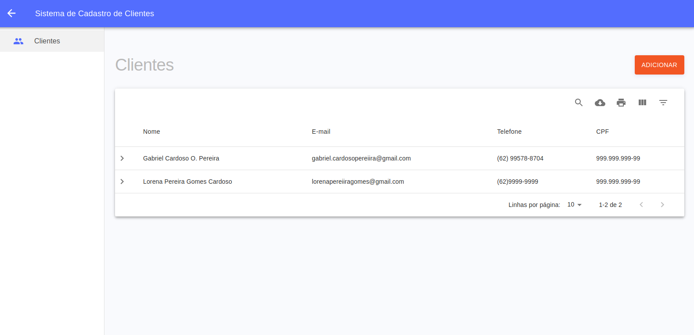

# Web application for customer registration

## <a href="https://qualicorp-clients.netlify.app">DEMO</a>

Back-End:<br />
https://github.com/gabriel-cardoso-oliveira/qualicorp-clients-server<br />

## Quick start

Install:

```
git clone https://github.com/gabriel-cardoso-oliveira/qualicorp-clients.git
```
```
cd qualicorp-clients/
```
```
yarn install
```

Test:

```
yarn run start
```

<p align="center">
  
</p>
